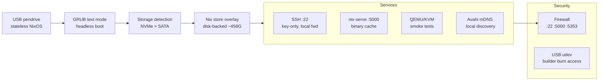
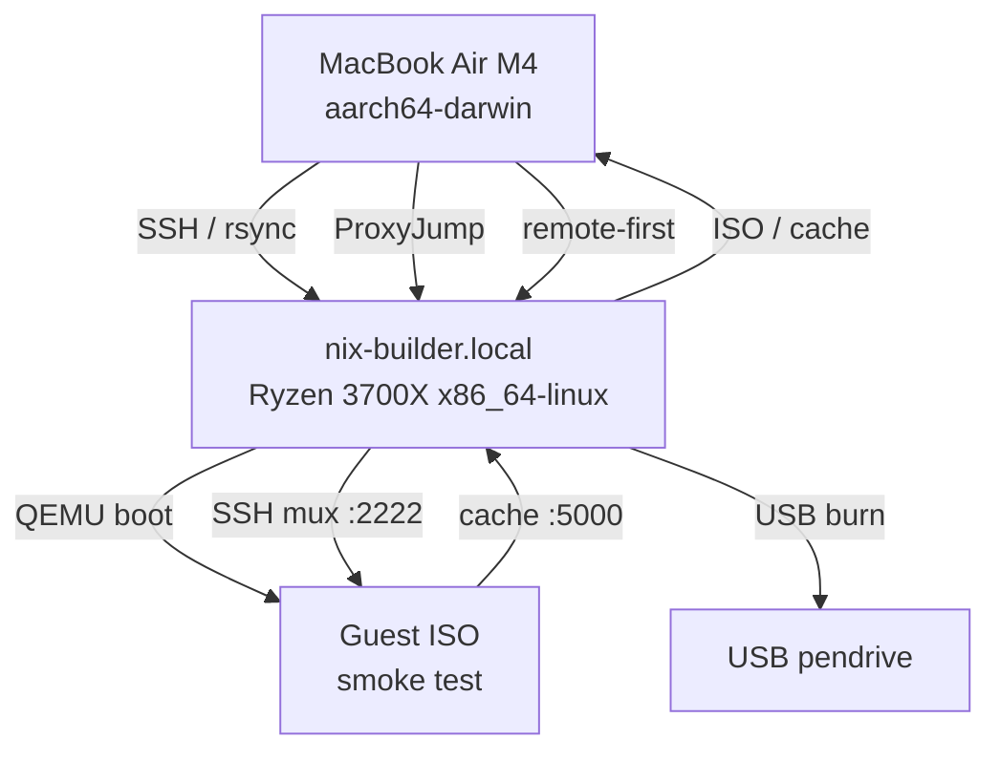
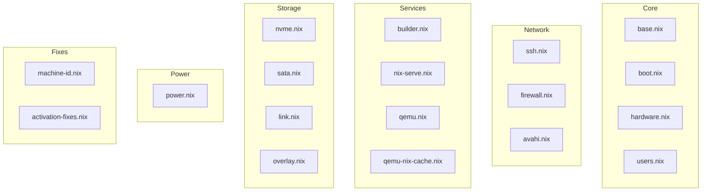
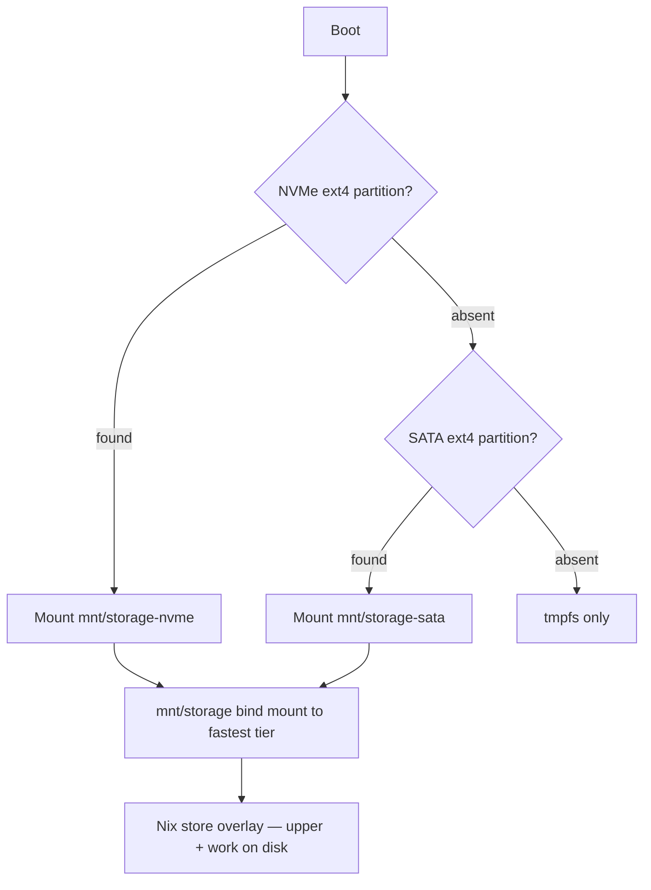
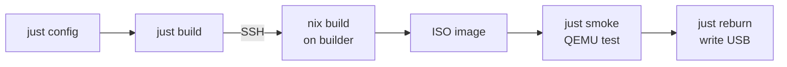

# nixos-nix-builder

[](https://github.com/pr0d1r2/nixos-nix-builder/actions/workflows/ci.yml)
[](LICENSE)

Bootable NixOS USB -- purpose-built nix builder appliance. No desktop, headless.

Boot a USB pendrive on any x86_64 machine and get a fully configured
nix builder with automatic storage detection, binary cache, and QEMU
support for smoke-testing other NixOS ISOs.

## Use case

Primary consumer: [nixos-poe2](https://github.com/pr0d1r2/nixos-poe2) --
builds its gaming ISO via `nix-builder.local` over SSH. Any flake-based
NixOS project can use this builder the same way.

## Using as a remote builder

Add the builder to your `nix.buildMachines` on any machine with SSH
access:

```nix
nix.buildMachines = [{
  hostName = "nix-builder.local";
  systems = [ "x86_64-linux" ];
  maxJobs = 16;
  speedFactor = 10;
  supportedFeatures = [ "nixos-test" "benchmark" "big-parallel" "kvm" ];
}];
nix.distributedBuilds = true;
```

Or use it directly from the command line:

```bash
nix build .#nixosConfigurations.myhost.config.system.build.isoImage \
  --builders 'ssh://nix-builder.local x86_64-linux'
```

The builder's binary cache on port 5000 serves anything it has already
built. Point your substituters at it to avoid redundant builds:

```nix
nix.settings.substituters = [ "http://nix-builder.local:5000" ];
```

## Architecture



## Development architecture



## Prerequisites

- [Nix](https://nixos.org/download/) with flakes enabled
- x86_64 target machine (Ryzen, Intel, etc.)
- SSH access to builder (or local build)
- USB pendrive (8 GB minimum, 128 GB recommended)

## Quick start

```bash
# Configure user preferences
just config

# Build ISO
just build

# Smoke test in QEMU
just smoke

# Burn to USB
just reburn
```

### All commands

| Command | Description |
|---------|-------------|
| `just config` | Configure user preferences (skips if complete) |
| `just build` | Build ISO (skips if SHA already built) |
| `just rebuild` | Force rebuild ISO for current SHA |
| `just smoke` | QEMU smoke test (builds first if needed) |
| `just boot` | Boot ISO in QEMU locally (Linux x86_64 only) |
| `just boot-remote` | Boot ISO in QEMU on remote builder |
| `just reburn` | Burn ISO to USB (interactive device picker) |
| `just reconfig` | Reconfigure all user preferences |

## NixOS module map



## Project structure

```text
flake.nix                    # ISO builder + devShell
modules/
  base.nix                   # Hostname, locale, headless config
  hardware.nix               # Ryzen 3700X (no GPU)
  ssh.nix                    # SSH server + baked authorized keys
  avahi.nix                  # mDNS (nix-builder.local)
  builder.nix                # Nix config, trusted-users, flakes
  nix-serve.nix              # Binary cache on :5000
  qemu.nix                   # QEMU packages
  qemu-nix-cache.nix         # fw_cfg-based cache for guests
  users.nix                  # builder + nixos users
  power.nix                  # Disable sleep/suspend/hibernate
  machine-id.nix             # Stable machine-id
  storage/
    nvme.nix                 # Mount largest NVMe ext4
    sata.nix                 # Mount largest SATA ext4
    link.nix                 # Symlink /mnt/storage -> fastest tier
    overlay.nix              # Nix store: tmpfs -> disk
fragments/
  storage-nvme-mount.sh      # NVMe detection script
  storage-sata-mount.sh      # SATA detection script
  storage-mount-target.sh    # Shared mount + log
  storage-link.sh            # Tier preference resolver
  nix-store-overlay.sh       # Bind-mount nix store to disk
  nix-cache-qemu.sh          # QEMU guest cache discovery
scripts/
  build/                     # SHA-versioned ISO build
  test-boot/                 # QEMU smoke testing
  config/                    # Interactive preference setup
  lib/                       # Shared utilities
config/user/                 # Build-time preferences
```

## Storage tier detection



At boot, the system automatically detects and mounts the fastest
available storage. `/mnt/storage` always points to the best tier.

### Nix store overlay

NixOS live ISOs use tmpfs for `/nix/store` by default. On a 32 GB
machine, a single `nix build` can fill RAM with store paths and OOM
the system.

The overlay moves the writable layer to disk:

```text
/nix/store (overlayfs)
  lower = ISO's read-only store (squashfs)
  upper = /mnt/storage/nix-store-overlay/upper
  work  = /mnt/storage/nix-store-overlay/work
```

New store paths land on disk instead of RAM. The full 32 GB stays
available for build processes, compiler caches, and parallel jobs.
On a RAM-only boot (no disk), the overlay is skipped and tmpfs is
used -- functional but capacity-limited.

## Build pipeline



## Boot sequence

1. **BIOS/UEFI** boots from USB pendrive (nomodeset, 1s timeout)
2. **Stage 1** (initrd) loads kernel and initial ramdisk
3. **Stage 2** starts systemd and mounts the root filesystem (tmpfs)
4. **Storage detection** scans for NVMe ext4, falls back to SATA ext4
5. **Mount** attaches found partition to `/mnt/nvme` or `/mnt/sata`
6. **Storage link** creates `/mnt/storage` symlink to fastest tier
7. **Nix store overlay** bind-mounts `/nix/store` upper layer to disk
8. **Services start** -- SSH, nix-serve, Avahi come up
9. **Ready** -- builder reachable at `nix-builder.local` via mDNS

On RAM-only boot (no ext4 disk found), steps 4-7 are skipped and
the nix store lives entirely in tmpfs. Builds work but RAM fills
quickly with store paths.

## Network services

| Port | Service | Protocol | Purpose |
|------|---------|----------|---------|
| 22 | SSH | TCP | Remote builds, admin access |
| 5000 | nix-serve | TCP | Binary cache for LAN clients |
| 5353 | Avahi | UDP | mDNS discovery (nix-builder.local) |

## Binary cache

nix-serve runs on port 5000, serving the local nix store as an
unsigned binary cache. QEMU guests auto-discover it via fw_cfg
injection -- no hardcoded URLs in guest ISOs.

### QEMU guest cache discovery

When the builder launches a guest ISO for smoke testing, it injects
the cache URL via QEMU's `fw_cfg` mechanism:

```
-fw_cfg name=opt/nixos-nix-builder/nix_cache_url,string=http://10.0.2.2:5000
```

The guest reads this at boot from
`/sys/firmware/qemu_fw_cfg/by_name/opt/nixos-nix-builder/nix_cache_url/raw`
and appends it to `/etc/nix/nix.conf` as an extra substituter. On real
hardware the `fw_cfg` path does not exist, so the script silently skips --
guest ISOs work on both QEMU and bare metal without configuration changes.

## Security hardening

The appliance ships with a locked-down configuration out of the box:

- **Firewall:** only ports 22 (SSH), 5000 (nix-serve), and 5353 (mDNS) are open
- **SSH:** MaxAuthTries=3, LoginGraceTime=30s, no agent/X11/TCP forwarding
- **Users:** `mutableUsers = false` -- no runtime user creation or password changes
- **Nix:** `sandbox = true` -- all builds run in isolated sandboxes
- **Credentials:** no secrets baked into the ISO -- the pendrive is stateless
- **Boot:** no desktop environment, no GUI, headless serial console only

## Environment variables

| Variable | Default | Purpose |
|----------|---------|---------|
| `QEMU_MEMORY` | `16G` | RAM allocated to QEMU smoke test VM |
| `QEMU_SMP` | `8` | CPU cores allocated to QEMU smoke test VM |

## Hardware

- **Target:** Ryzen 7 3700X, 32 GB RAM, NVMe + SATA storage
- **Dev host:** MacBook Air M4 (aarch64-darwin)
- **USB:** Kingston DataTraveler Kyson 128 GB (USB 3.2 Gen 1)

## Troubleshooting

### Builder unreachable from macOS

```bash
ping nix-builder.local
```

If mDNS resolution fails, check that Avahi is running on the builder
and both machines are on the same network segment. `just build` exits
early on macOS when the builder is not reachable.

### Storage not detected at boot

The builder mounts the largest ext4 partition on NVMe (then SATA as
fallback). If no ext4 partition exists, the nix store runs on tmpfs
only -- builds will fill RAM quickly. Format a partition with ext4
before booting:

```bash
mkfs.ext4 /dev/nvme0n1p1
```

### ISO too large for USB

The burn script checks ISO size against USB capacity before writing.
If the ISO exceeds USB size, use a larger pendrive or trim the NixOS
configuration (remove unused packages from `environment.systemPackages`).

## See also

- [CONTRIBUTING.md](CONTRIBUTING.md) -- development workflow and code style
- [CHANGELOG.md](CHANGELOG.md) -- release history and unreleased changes
- [LICENSE](LICENSE) -- MIT
